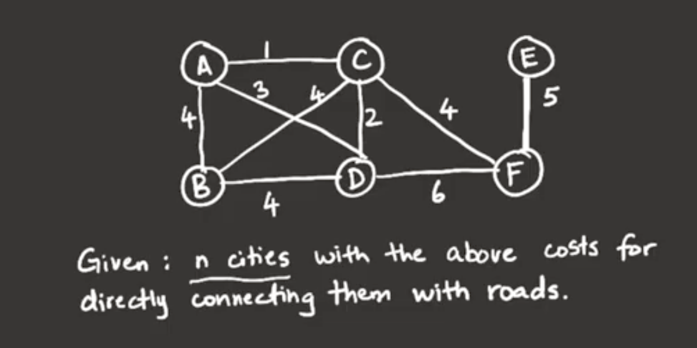
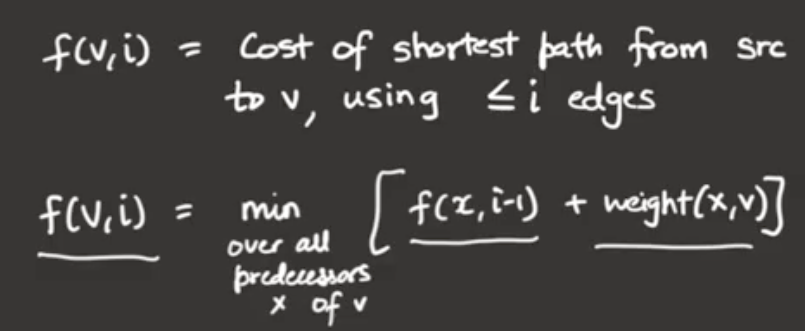

# Advanced_Graphs

Finding connected components is 3 step process
1) Build graph from the given adjues list
2) Travrse either BFS/DFS
3) Outer Loop, which lauches the BFS or DFS number of times

Above approach will not work if the edges are added Dynamically.

So we have to follow different approach for this.
-> Uninon and Find  O(m logn)   m = adjes n = nodes
-> Amortized time complexity is O(n)
-> because find operation we do path compressopn, so ideally find operation is constant time.

## Minimum spanning tree problem

spanning tree is
- Which is connected
- no cycles
- spans all vertices

# Greedy Algorithm(union and Find program we can use)
 - At Each step add the next chepest edge as long as it doesn;'t create a cycle
 - it works to form a minimal spanning tree because it satisfies optimal
 substructure property.
 - it means if we are able to find the minimin path between any 2 nodes, the leads overall optimization as well along with substructure optimization.

# Kruskals Algoritham(union and find program only)
- sort the edge weights in increasing order
- chose the edges with small weight and check if it is forming a loop
- if not then consider it, like that grow the structre to form a min spanning tree

# Prims Algorithm
steps:
1) start build spanning tree from any vertex.
2) In each step check all the edges crossing from LHS to RHS    
3) Choose minimum weight edge in that.
4) O(m log m)  or O(n log n)

# Dijkstra - single source shortest path
-   we can use this for directed graph
-  we use this in problems like : Given a weighted directed graph with positive edge weights treat 's' as a source vertex find shorted path from 's' to 'd'

# BellmanFord or dynamic programming

323: https://leetcode.com/problems/number-of-connected-components-in-an-undirected-graph/
https://leetcode.com/problems/friend-circles/

261: https://leetcode.com/problems/graph-valid-tree/ 
785: https://leetcode.com/problems/is-graph-bipartite/